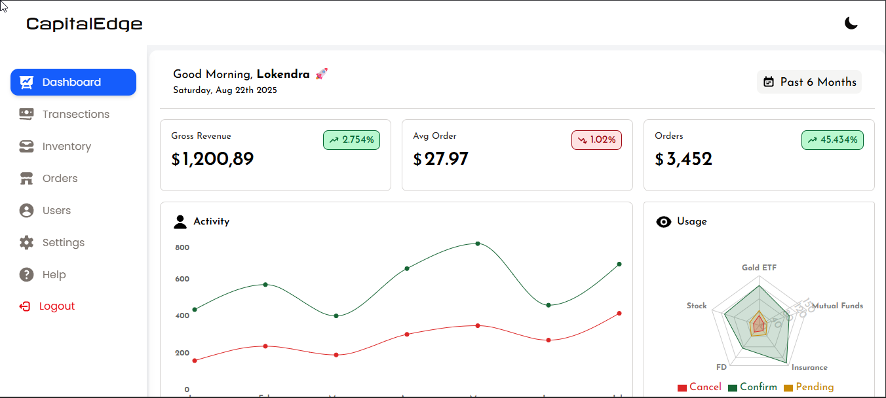
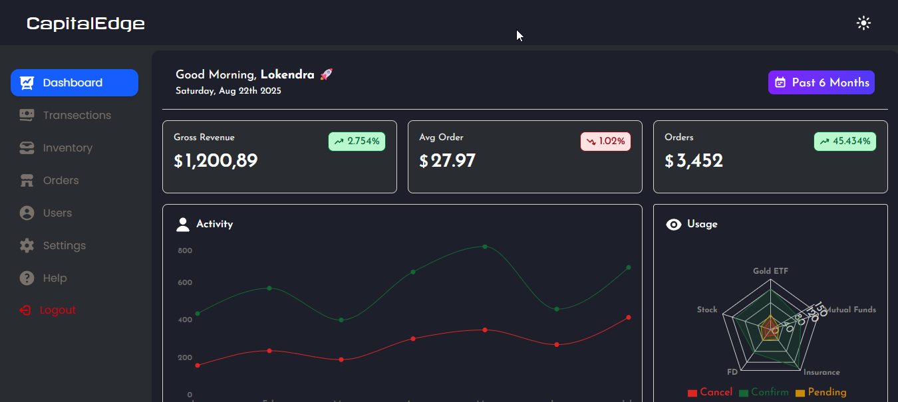
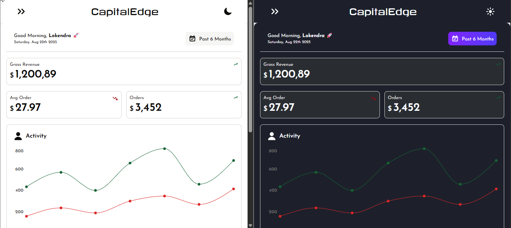

# 📊 CapitalEdge - Finance Admin Dashboard

This is a **CapitalEdge Admin Page** built using **React + TailwindCSS + React Router + Recharts + Zustand**.  
The purpose of this project is to **improve my frontend development skills** and practice building real-world admin dashboards.

### For Login -

- Email - lokendra@x.com
- Pass - lokendra

---

## 📷 Preview

### Light Mode ☀️



### Dark Mode 🌙



### Mobile 🌙



---

## 🚀 Tech Stack

- ⚛️ **React** – UI Library
- 🎨 **TailwindCSS** – Styling framework
- 🛣️ **React Router v7** – Client-side routing
- 📈 **Recharts** – Data visualization & graphs
- 💾 **Zustand** - For State Managment

---

## ✨ Features

- 📌 Sidebar navigation with active route highlighting
- 📊 Finance graphs (Revenue, Expenses, Sales trends, etc.)
- 📅 Date-based filters (e.g., Past 6 Months, Trailing Year)
- 📱 Responsive design for desktop & mobile
- ⚡ Clean and modern UI with Tailwind

---

## 🎯 Learning Goals

This project helps me practice and strengthen:

- React Router navigation & layouts
- State management with React Hooks
- Data visualization with Recharts
- Building responsive dashboards using Tailwind

---

## 📦 Installation & Setup

Clone the repo and install dependencies:

```bash
git clone https://github.com/LokendraNath/Admin-Dashboard.git
cd Admin-Dashboard
npm install
npm run dev
```
